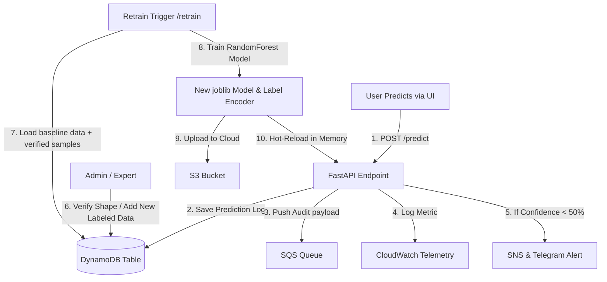

# Project Machine Learning: Volcano Eruption Prediction

Proyek ini berfokus pada pengembangan model klasifikasi untuk memprediksi tipe aktivitas vulkanik berdasarkan fitur geofisika dan sensorik, mendukung migrasi arsitektur **AWS Free Tier**, serta memiliki **Dynamic Retraining & Hot-Reload Pipeline** yang canggih.

---

## 📁 Struktur Direktori Proyek

Proyek ini dipisah secara bersih antara Backend dan Frontend untuk menjaga kerapihan struktur monorepo:
* **`backend/`**: Berisi script Python FastAPI (`main.py`), modul layanan AWS (`aws_service.py`), docker setup, dan file kredensial (`.env`).
* **`frontend/`**: Berisi halaman statis (`index.html`), lembar gaya CSS (`style.css`), dan skrip interaksi klien (`app.js`).

---

## 🌟 Fitur Utama
* **Preprocessing Data:** Pembersihan data *missing values*, normalisasi, dan *feature engineering* pada dataset aktivitas gunung berapi.
* **Model Machine Learning:** Implementasi algoritma klasifikasi (Random Forest Classifier) untuk prediksi akurat.
* **Evaluasi Performa:** Penggunaan metrik *Accuracy*, *Precision*, *Recall*, dan *F1-Score*.
* **AWS Free Tier Integration**: Mendukung penyimpanan model di **S3**, logging dinamis di **DynamoDB**, antrean asinkron **SQS**, peringatan email **SNS**, alarm **Telegram**, serta metrik performa di **CloudWatch**.
* **Zero-Downtime Hot-Reload**: Melatih ulang model ML di server berdasarkan log DynamoDB terbaru dan langsung me-hotload model tersebut ke memori tanpa perlu merestart server.

---

## Arsitektur Proyek



---

## Teknologi yang Digunakan
* **Bahasa:** Python & Vanilla JavaScript
* **Library Utama:** 
    * `scikit-learn` & `joblib`: Pemodelan machine learning.
    * `pandas` & `numpy`: Manipulasi dan analisis data.
    * `boto3`: AWS SDK untuk integrasi S3, DynamoDB, SNS, SQS, dan CloudWatch.
    * `fastapi` & `uvicorn`: API framework asinkron berkinerja tinggi.

---

## 🚀 Panduan Lengkap: Dari LocalStack ke AWS EC2 Free Tier

### 1. Jalankan Simulasi Lokal dengan LocalStack (100% Gratis)

LocalStack mensimulasikan layanan AWS di komputer lokal sehingga Anda dapat menguji pipeline ML tanpa biaya sepeser pun.

#### Langkah A: Jalankan LocalStack via Docker
Pastikan Docker Desktop aktif, kemudian jalankan perintah berikut di terminal:
```bash
docker run --rm -it -p 4566:4566 -p 4510-4559:4510-4559 localstack/localstack
```

atau langkah dibawah ini:

```bash
// Start Localstak
localstack start -d
```

```bash
// Stop Localstak
localstack stop
```

#### Langkah B: Setup Virtual Environment & Install Dependensi
Buka terminal di root folder proyek:
```bash
# 1. Buat virtual environment
python -m venv venv

# 2. Aktifkan virtual environment
# Windows:
.\venv\Scripts\activate
# Linux/macOS:
source venv/bin/activate

# 3. Masuk ke folder backend
cd backend

# 4. Install library Python
pip install -r requirements.txt
```

#### Langkah C: Konfigurasi File `.env` Lokal
Salin file `backend/.env.example` menjadi `backend/.env` dan pastikan konfigurasi berikut aktif untuk LocalStack:
```env
USE_LOCALSTACK=True
LOCALSTACK_ENDPOINT=http://localhost:4566
AWS_REGION=us-east-1
AWS_ACCESS_KEY_ID=test
AWS_SECRET_ACCESS_KEY=test
S3_BUCKET_NAME=volcano-classifier-models
DYNAMODB_TABLE_NAME=Volcano_Dataset
SNS_TOPIC_NAME=Volcano_Alerts
SQS_QUEUE_NAME=Volcano_Inference_Queue
```

#### Langkah D: Jalankan Server FastAPI Uvicorn
Jalankan perintah ini dari dalam folder `backend/`:
```bash
uvicorn main:app --reload --port 8080
```
> [!NOTE]
> Aplikasi akan secara otomatis mendeteksi ketiadaan resource dan memanggil `aws_service.init_resources()` untuk membuat S3 Bucket, DynamoDB Table, SNS Topic, dan SQS Queue di LocalStack saat boot!

---

### 1b. Simulasi Layanan EC2 di LocalStack (Lokal & Gratis)

Anda dapat melatih kemampuan administrasi cloud Anda secara lokal dengan membuat instansi virtual tiruan di dalam LocalStack menggunakan `awslocal`:

1. **Membuat Mock Key Pair untuk Akses SSH:**
   ```bash
   awslocal ec2 create-key-pair --key-name volcano-key --query 'KeyMaterial' --output text > volcano-key.pem
   ```
2. **Membuat Security Group Kustom:**
   ```bash
   awslocal ec2 create-security-group --group-name volcano-sg --description "Volcano Security Group"
   ```
3. **Mengizinkan Port Masuk (SSH Port 22 & API Port 8080):**
   ```bash
   awslocal ec2 authorize-security-group-ingress --group-name volcano-sg --protocol tcp --port 22 --cidr 0.0.0.0/0
   awslocal ec2 authorize-security-group-ingress --group-name volcano-sg --protocol tcp --port 8080 --cidr 0.0.0.0/0
   ```
4. **Meluncurkan Instansi EC2 Mock:**
   ```bash
   awslocal ec2 run-instances --image-id ami-df5de72f --count 1 --instance-type t2.micro --key-name volcano-key --security-groups volcano-sg
   ```
5. **Memeriksa Status EC2 Tiruan Anda:**
   ```bash
   awslocal ec2 describe-instances --query "Reservations[*].Instances[*].[InstanceId,State.Name]" --output table
   ```

---

### 2. AWS Free Tier Production Deployment (EC2 Instance)

Untuk mendeploy aplikasi ke cloud asli secara gratis menggunakan jatah AWS Free Tier:

#### Langkah A: Persiapan Layanan AWS (Console)
1. **S3**: Buat bucket bernama `volcano-classifier-models` (atau nama kustom yang unik secara global).
2. **DynamoDB**: Buat tabel bernama `Volcano_Dataset` dengan Partition Key `id` bertipe String (`S`).
3. **SNS**: Buat Standard Topic bernama `Volcano_Alerts` dan klik **Create Subscription** untuk mendaftarkan email Anda.
4. **SQS**: Buat Standard Queue bernama `Volcano_Inference_Queue`.
5. **IAM**: Buat IAM User dengan hak akses penuh ke S3, DynamoDB, SNS, SQS, dan CloudWatch. Dapatkan **Access Key ID** dan **Secret Access Key**-nya.

#### Langkah B: Setup EC2 Instance (Ubuntu t2.micro)
1. Buka AWS EC2 Console -> **Launch Instance**.
2. Pilih AMI **Ubuntu Server 22.04 LTS** (Eligible for Free Tier).
3. Pilih Instance Type **t2.micro** (Memberikan 750 jam penggunaan gratis per bulan).
4. Buat/pilih Key Pair (.pem) untuk akses SSH.
5. Pada **Security Groups**, izinkan port berikut dari Anywhere (`0.0.0.0/0`):
   * Port `22` (SSH) untuk remote server.
   * Port `8080` (FastAPI) untuk akses publik.
6. Klik **Launch Instance**.

#### Langkah C: Instalasi & Menjalankan Aplikasi di EC2
1. Hubungkan terminal Anda ke EC2 menggunakan SSH:
   ```bash
   ssh -i "volcano-key.pem" ubuntu@IP_PUBLIK_EC2_ANDA
   ```
2. **Pasang Dependensi Sistem:**
   ```bash
   sudo apt update && sudo apt upgrade -y
   sudo apt install git docker.io -y
   sudo systemctl enable --now docker
   ```
3. **Clone Repository & Setup `.env` Produksi:**
   ```bash
   git clone https://github.com/Muhammad-Ikhwan-Fathulloh/Project-Machine-Learning-Volcano.git
   cd Project-Machine-Learning-Volcano/backend
   cp .env.example .env
   nano .env
   ```
   *Ubah `USE_LOCALSTACK=False`, isi kredensial IAM `AWS_ACCESS_KEY_ID` & `AWS_SECRET_ACCESS_KEY` asli Anda, dan masukkan nama-nama resource AWS Anda sesuai Step 2.1.*
4. **Jalankan Menggunakan Docker:**
   ```bash
   # Masuk ke direktori backend (tempat Dockerfile berada)
   cd ~/Project-Machine-Learning-Volcano/backend
   
   # Build image Docker kustom
   sudo docker build -t volcano-classifier-api .
   
   # Jalankan container di background
   sudo docker run -d --name volcano-api --restart always -p 8080:8080 --env-file .env volcano-classifier-api
   ```

---

## 🖥️ Fase 4: Mengakses Hub Dashboard

Aplikasi AI Anda kini telah aktif di awan!

1. Buka file [frontend/index.html](file:///c:/laragon/www/backend_volcano_classifier/frontend/index.html) lokal Anda di browser.
2. Scroll ke bagian paling bawah tempat script JavaScript didefinisikan (di dalam [frontend/app.js](file:///c:/laragon/www/backend_volcano_classifier/frontend/app.js)).
3. Ganti konstanta `API_BASE_URL` dengan alamat IP Publik EC2 Anda:
   ```javascript
   const API_BASE_URL = "http://IP_PUBLIK_EC2_ANDA:8080";
   ```
4. Refresh browser. Status indikator di kanan atas akan langsung menyala hijau menandakan **`API Online`**!

---

## 🛠️ Cara Uji Coba API via Python CLI

Anda juga dapat menguji seluruh API secara langsung (Inference, Batch, Add Labeled Data, Verify, dan Retraining) melalui file skrip otomasi Python CLI yang disediakan:
```bash
cd backend
python test_api.py
```
Skrip ini akan mengirimkan payloads JSON dan mencetak klasifikasi laporan performa ML model yang baru saja dilatih ulang langsung di terminal Anda!

---

## Kontribusi
Kontribusi sangat terbuka. Silakan buka *issue* atau ajukan *pull request* untuk pengembangan sistem mitigasi dini bencana gunung meletus berbasis kecerdasan buatan.